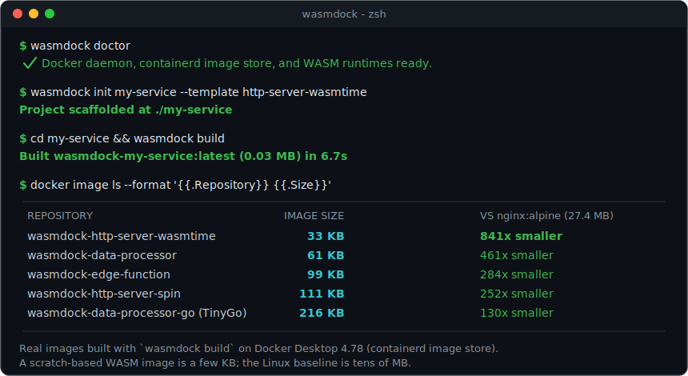
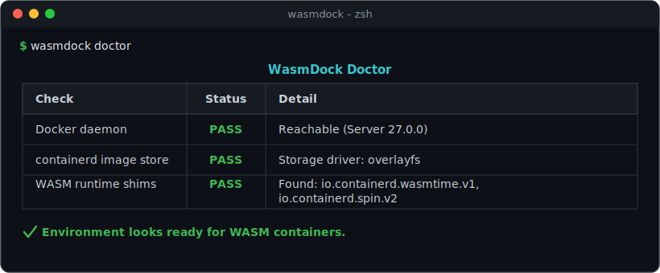

# WasmDock

**Scaffold, build, run, and benchmark WebAssembly containers with Docker's native WASM runtime.**

[](https://github.com/hariharanragothaman/wasmdock/actions/workflows/ci.yml)
[](https://codecov.io/gh/hariharanragothaman/wasmdock)
[](https://www.python.org/downloads/)
[](LICENSE)



---

## Motivation

Docker's native WebAssembly support is one of the most exciting recent additions
to the container ecosystem, but getting from "enabled in Docker Desktop" to a
working, benchmarked WASM service still means wrestling with cross-compilation
toolchains, containerd shims, the `wasi/wasm` platform, and OCI packaging.

**WasmDock collapses that into a handful of commands.** It scaffolds idiomatic
projects, builds minimal `scratch`-based WASM images, runs them through the right
runtime shim, and quantifies the cold-start / size / memory wins against a Linux
baseline — so you can focus on the workload instead of the plumbing.

Full documentation: **https://hariharanragothaman.github.io/wasmdock/**

## Why WASM Containers?

Docker Desktop 4.15+ supports running WebAssembly workloads natively alongside Linux containers. The headline win is **image size** — and these are real, measured numbers from WasmDock's own templates (built on Docker Desktop 4.78 with the containerd image store), compared against `nginx:alpine` (**27.4 MB**):

| WasmDock template            | Toolchain | Image size | vs `nginx:alpine` |
|------------------------------|-----------|-----------:|-------------------|
| `http-server-wasmtime`       | Rust      |   **33 KB**| 841× smaller      |
| `data-processor`             | Rust      |     61 KB  | 461× smaller      |
| `edge-function`              | Spin      |     99 KB  | 284× smaller      |
| `http-server-spin`           | Spin      |    111 KB  | 252× smaller      |
| `data-processor-go`          | TinyGo    |    216 KB  | 130× smaller      |

Beyond size, WASM containers also offer near-instant cold starts, a smaller memory
footprint, and a capability-based sandbox on top of normal container isolation.

WasmDock gives you a batteries-included toolkit to take advantage of these improvements without wrestling with low-level toolchain configuration.

## Prerequisites

- **Docker Desktop 4.15+** with WASM support enabled
  - Settings > Features in development > Enable WASM
  - Settings > General > Use containerd for pulling and storing images
- **Python 3.10+**
- **Rust toolchain** (installed automatically inside Docker build)

## Installation

Install from source (recommended while the first PyPI release is being prepared):

```bash
git clone https://github.com/hariharanragothaman/wasmdock.git
cd wasmdock
pip install -e ".[dev]"
```

Once published to PyPI:

```bash
pip install wasmdock
```

## Quick Start

```bash
# Verify your Docker environment is WASM-ready
wasmdock doctor

# Scaffold a new WASM HTTP service
wasmdock init my-service --runtime wasmtime --template http-server-wasmtime

# Build the WASM module and Docker image
cd my-service
wasmdock build

# Run the container
wasmdock run --port 8080

# Inspect logs and stop it
wasmdock logs --tail 50
wasmdock stop

# Benchmark against a Linux baseline
wasmdock bench --iterations 50 --compare-linux nginx:alpine --output report.html
```

> Prefer a ready-to-build project? See [`examples/hello-wasm`](examples/hello-wasm),
> which ships the exact output of `wasmdock init` plus a `Makefile` (`make doctor`,
> `make build`, `make run`, `make bench`).

You can also invoke the CLI as a module: `python -m wasmdock --help`.

## CLI Reference

### `wasmdock init <name>`

Scaffold a new WASM project from a template.

| Option         | Default                | Description                                    |
|----------------|------------------------|------------------------------------------------|
| `--runtime`    | template's runtime     | WASM runtime: wasmtime, wasmedge, spin, slight |
| `--language`   | `rust`                 | Source language                                |
| `--template`   | `http-server-wasmtime` | Project template                               |
| `--output-dir` | `.`                    | Parent directory for the new project           |

If `--runtime` is omitted, the runtime the template targets is used. Passing a
runtime that is incompatible with the template (e.g. `--template http-server-spin
--runtime wasmtime`) is rejected with a helpful error.

### Shell completion

WasmDock ships shell completion (bash/zsh/fish/PowerShell), courtesy of Typer:

```bash
wasmdock --install-completion   # install for your current shell
wasmdock --show-completion      # print the script instead
```

### `wasmdock build`

Build the WASM module and package it as a Docker image.

| Option         | Default | Description                |
|----------------|---------|----------------------------|
| `--project-dir`| `.`     | Path to wasmdock project   |

### `wasmdock run`

Start the WASM container with the correct runtime shim. Re-running replaces any
existing container for the project, so `run` is safe to invoke repeatedly.

| Option         | Default | Description              |
|----------------|---------|--------------------------|
| `--port`       | `8080`  | Host port to bind        |
| `--project-dir`| `.`     | Path to wasmdock project |

### `wasmdock stop`

Stop and remove the container started for the project (resolved from `wasmdock.yml`).

| Option         | Default | Description              |
|----------------|---------|--------------------------|
| `--project-dir`| `.`     | Path to wasmdock project |

### `wasmdock logs`

Show recent logs from the project's running container.

| Option         | Default | Description                      |
|----------------|---------|----------------------------------|
| `--tail`       | `100`   | Number of trailing log lines     |
| `--project-dir`| `.`     | Path to wasmdock project         |

### `wasmdock ps`

List WasmDock-managed containers (name, status, image, ports).

### `wasmdock clean`

Stop and remove the project's container, and optionally its image.

| Option         | Default | Description                          |
|----------------|---------|--------------------------------------|
| `--images`     | `false` | Also remove the project's WASM image |
| `--project-dir`| `.`     | Path to wasmdock project             |

### `wasmdock bench`

Run benchmarks on the WASM container.

| Option           | Default | Description                            |
|------------------|---------|----------------------------------------|
| `--iterations`   | `100`   | Number of cold-start iterations        |
| `--compare-linux`| (none)  | Linux image to benchmark against       |
| `--output`       | (none)  | Path for the HTML report               |
| `--project-dir`  | `.`     | Path to wasmdock project               |

### `wasmdock push <target>`

Push the WASM image to an OCI-compliant registry.

```bash
wasmdock push ghcr.io/youruser/my-service:latest
```

### `wasmdock pull <reference>`

Pull a WASM image from an OCI-compliant registry (using the `wasi/wasm` platform).

```bash
wasmdock pull ghcr.io/youruser/my-service:latest
```

### `wasmdock templates`

List all available project templates.

```
+----------------------+-------------------------------------------+---------+------+
| Name                 | Description                               | Runtime | Lang |
+----------------------+-------------------------------------------+---------+------+
| http-server-spin     | HTTP microservice using Fermyon Spin SDK   | spin    | rust |
| http-server-wasmtime | Standalone WASI HTTP server               | wasmtime| rust |
| data-processor       | Stdin/stdout data processing pipeline     | wasmtime| rust |
| edge-function        | Lightweight edge computing request handler| spin    | rust |
+----------------------+-------------------------------------------+---------+------+
```

### `wasmdock runtimes`

List all supported WASM runtimes with their containerd shim identifiers.

### `wasmdock doctor`

Diagnose whether the local Docker environment is ready for WASM containers. Checks
that the Docker daemon is reachable, the containerd image store is enabled, and which
WASM runtime shims are installed. Exits non-zero if a required check fails, so it can
gate CI or a setup script.

```bash
wasmdock doctor
```



## Template Gallery

### HTTP Server (Wasmtime)

A standalone WASI HTTP server targeting the Wasmtime runtime. Best for general-purpose microservices.

```bash
wasmdock init my-api --template http-server-wasmtime --runtime wasmtime
```

### HTTP Server (Spin)

An HTTP microservice built with Fermyon's Spin SDK. Best for event-driven request handlers.

```bash
wasmdock init my-handler --template http-server-spin --runtime spin
```

### Data Processor

A stdin/stdout data pipeline for batch processing workloads. Reads newline-delimited JSON, transforms records, and writes results.

```bash
wasmdock init my-pipeline --template data-processor --runtime wasmtime
```

### Data Processor (Go / TinyGo)

The same stdin/stdout pipeline, written in Go and compiled to WASI with TinyGo.
Demonstrates a non-Rust toolchain end to end.

```bash
wasmdock init my-go-pipeline --template data-processor-go
```

### Edge Function

A lightweight request handler optimized for edge computing with sub-millisecond cold starts.

```bash
wasmdock init my-edge --template edge-function --runtime spin
```

## Benchmark Example

```bash
wasmdock bench --iterations 50 --compare-linux nginx:alpine --output report.html
```

### Measured image size

These figures are **real**, produced by building the templates with `wasmdock build`
on Docker Desktop 4.78 (containerd image store) and reading `docker image inspect`,
compared against `nginx:alpine` (27.4 MB):

| Template                | WASM image | Linux baseline | Reduction      |
|-------------------------|-----------:|---------------:|----------------|
| `http-server-wasmtime`  |      33 KB |        27.4 MB | 841× (99.88%)  |
| `data-processor`        |      61 KB |        27.4 MB | 461× (99.78%)  |
| `edge-function`         |      99 KB |        27.4 MB | 284× (99.65%)  |
| `http-server-spin`      |     111 KB |        27.4 MB | 252× (99.60%)  |
| `data-processor-go`     |     216 KB |        27.4 MB | 130× (99.23%)  |

### Cold start, memory & throughput

`wasmdock bench` also measures cold-start latency, memory footprint, and throughput,
and `--output` renders an interactive Plotly HTML report. Those runtime metrics
require executing the containers; capturing them here is pending a Docker Desktop
wasm-runtime fix (see issue #20), so they are intentionally **not** quoted as
measured numbers yet.

## Supported Runtimes

| Runtime                    | Containerd Shim                  | Best For                     |
|----------------------------|----------------------------------|------------------------------|
| Wasmtime                   | `io.containerd.wasmtime.v1`      | General-purpose WASI apps    |
| WasmEdge                   | `io.containerd.wasmedge.v1`      | Edge computing, AI inference |
| Fermyon Spin               | `io.containerd.spin.v2`          | Event-driven microservices   |
| SpiderLightning (slight)   | `io.containerd.slight.v1`        | Capability-oriented apps     |

## Architecture

```
wasmdock
  |-- cli.py           Typer CLI with subcommands
  |-- __main__.py       `python -m wasmdock` entry point
  |-- scaffolder.py     Jinja2 template rendering engine
  |-- builder.py        Docker BuildKit pipeline (cross-compile + package)
  |-- runner.py         Container lifecycle management
  |-- benchmarker.py    Cold-start, memory, throughput benchmarking
  |-- registry.py       OCI registry push/pull
  |-- doctor.py         Docker WASM environment diagnostics
  |-- models.py         Core dataclasses and runtime enum
  |-- config.py         YAML configuration loading
  |-- templates/        Jinja2 project templates
       |-- http_server_spin/
       |-- http_server_wasmtime/
       |-- data_processor/
       |-- edge_function/
```

The build pipeline uses Docker's multi-stage builds: a Rust build stage cross-compiles to `wasm32-wasip1`, and the final stage copies the `.wasm` binary into a `scratch` image with no OS layer. Docker's containerd integration routes execution to the appropriate WASM runtime shim.

## Contributing

See [CONTRIBUTING.md](CONTRIBUTING.md) for development setup, coding standards, and contribution guidelines.

## License

MIT License. See [LICENSE](LICENSE) for details.
